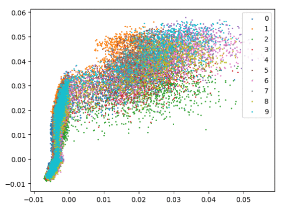
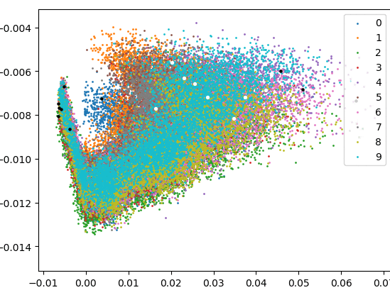
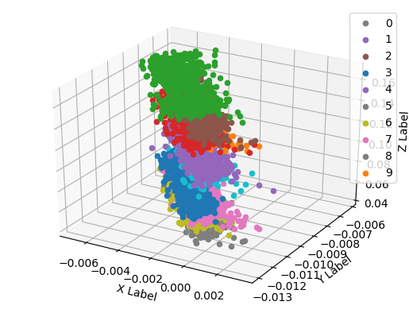

# [pytorch] Discover the density information with center loss function. [*in progress*]
###### based on: Pytorch implementation of center loss: [Wen et al. A Discriminative Feature Learning Approach for Deep Face Recognition. ECCV 2016](https://ydwen.github.io/papers/WenECCV16.pdf) at [KaiyangZhou's github repository.](https://github.com/KaiyangZhou/pytorch-center-loss/)
---

## Why do it?
The center loss function guides the latent features towards the categorical centers. On the other hand, the cross-entropy loss function drives the latent features towards the points that render the large possibilities. So here I'd like to visualize where the samples rendering the largest possibilities will embed in the latent space.

## Conclusions [*so far 0602*]
+ [x] With cross-entropy loss, the samples that is further away from other categories give larger output possibilities.
+ [x] The centers learned by the center loss function seems to be the centers of gravity of each class.
+ [x] The centers learned by the center loss function are NOT the samples that give the largest prediction possibilities.
+ [x] Classes surrounded by other classes have smaller prediction possibilities, at least before the middle training stage.

## Get started
Please run the main python file in each directory. More details regarding input arguments can be found within each main file.

## 2D Results
I visualized the center of gravity and largest/smallest density learning process below.

Softmax only. Left: training set. (by KaiyangZhou)

  

Softmax + CenterLoss (on training set only). (.gif file was generated via `https://ezgif.com/maker`)
  + Left: White dots represent the learned centers of gravity, and the black dots represent the samples that render the `largest` prediction possibilities within each category.
  + Right: White dots represent the learned centers of gravity, and the black dots represent the samples that render the `smallest` prediction possibilities within each category.

  
  

## 3D Result
+ [x] 3D plot: (2d)features + prediction probability as the z-axis.

  

## To-do
+ [ ] Two centers correlate with each other.
